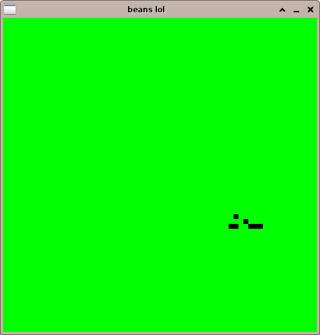
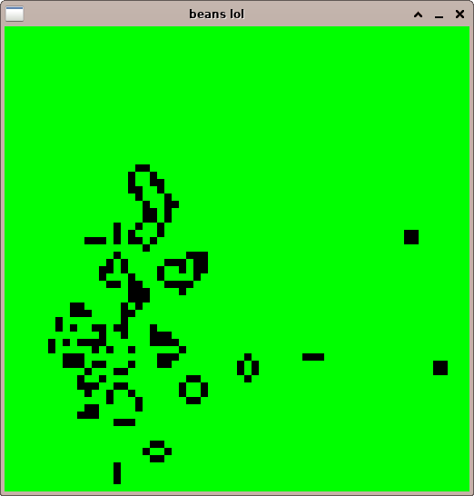

# Game of Life

Conway's [Game of Life](https://en.wikipedia.org/wiki/Conway%27s_Game_of_Life) written in CommonLisp

## Usage

```
./gol.sh 250 250 # width height
```

## Dependencies

- SDL
- sbcl
- quicklisp (see pdf for setup details)
- lispbuilder-sdl

## Controls

|              |             |
|-             |-            |
| ESC          | quit        |
| p            | play/pause  |
| CLICK        | toggle cell |
| wasd         | move camera |
| CLICK + DRAG | move camera |
| +-           | zoom in/out |
| SCROLL       | zoom in/out |
| r            | reset       |

## Acorn pattern





